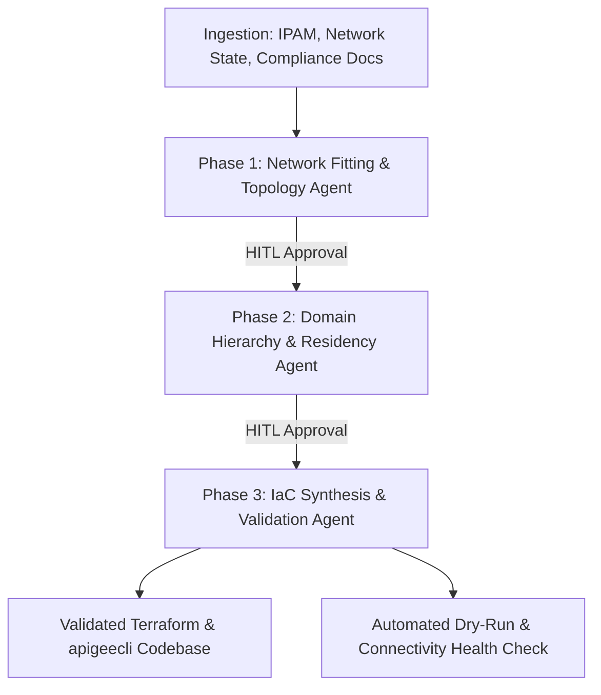

Here is the raw Markdown version of the design document. You can easily click the **"Copy code"** button in the top right corner of the block below and save it directly as your `designdocument.md` file.

```markdown
# 📄 designdocument.md: ApiX-Blueprint AI

**Document Version:** 1.0  
**Project:** ApiX-Blueprint AI (Apigee X Automated Enablement Platform)  
**Target Audience:** Enterprise Architecture Review Board, Cloud Network Engineering, Lead Consultants  
**Tags:** `#ApigeeX`, `#GenAI`, `#MultiAgent`, `#InfrastructureAsCode`, `#Terraform`, `#CloudNetworking`, `#PrivateServiceConnect`, `#AppMod`, `#DeliveryAutomation`

---

## 1. Executive Summary
**ApiX-Blueprint AI** is an intelligent, multi-agent generative workflow designed to automate the end-to-end provisioning, network architecture, and domain hierarchy setup of Apigee X. 

Provisioning Apigee X in enterprise environments is traditionally a highly complex, multi-week process heavily reliant on manual infrastructure design, mathematical IP address calculations, and bespoke Terraform authoring. By shifting away from manual discovery, this platform leverages specialized AI agents to ingest current state data, mathematically resolve routing/CIDR conflicts, map compliance mandates, and generate Google-validated Infrastructure as Code (IaC).

## 2. High-Level Architecture & End-to-End Flow
The system operates on a **Human-in-the-Loop (HITL) Multi-Agent Pipeline**. It acts as a sequential workflow where the outputs of one phase act as the strict contextual constraints for the next. Human architects review and approve the output of each phase before the AI proceeds.



---

## 3. Phase 1: The Network Fitting & Topology Engine

**Objective:** Mathematically and architecturally resolve how the Google-managed Apigee X tenant connects to a highly regulated enterprise VPC without causing IP collisions, breaking security perimeters, or hitting transitive routing limits.

### 3.1. Inputs / Ingestion

* **IP Address Management (IPAM) Data:** CSV/JSON exports from enterprise IPAM tools (e.g., InfoBlox, SolarWinds).
* **Existing Network State:** `.tfstate` files of the customer's current GCP Network Foundation.
* **Architecture Inputs:** Enterprise network diagrams (parsed via Gemini Vision) and ingress/egress requirements.

### 3.2. Agentic Reasoning & Execution

1. **Mathematical CIDR Resolution:** Apigee X requires a `/22` CIDR block for runtime instances and a `/28` block for Google support troubleshooting. The agent's math engine parses the customer’s IPAM to identify non-overlapping RFC 1918 IP spaces and automatically proposes conflict-free allocations.
2. **Connectivity Strategy Selection (PSC vs. Peering):** The agent evaluates the existing network topology. If legacy transitivity limits are detected (e.g., the customer needs to route traffic through multiple peered VPCs or on-premises Interconnects), the agent bypasses standard VPC Peering and designs a **Private Service Connect (PSC)** topology.
3. **Northbound (Ingress) Design:** Maps the Global External L7 Application Load Balancer (GXLB) to PSC Network Endpoint Groups (NEGs), attaching necessary Cloud Armor WAF policies.
4. **Southbound (Egress) Design:** Maps Apigee runtime egress to PSC Endpoint Attachments, bridging the Apigee tenant to backend customer microservices safely across VPC boundaries.

### 3.3. Phase 1 Outputs

* An AI-generated **Network Architecture Diagram** (exported as PlantUML/Mermaid/JSON).
* A machine-readable blueprint detailing exact Subnet allocations, PSC configurations, and Firewall/Cloud NAT requirements for the Lead Network Engineer's sign-off.

---

## 4. Phase 2: Domain Hierarchy & Compliance Architect

**Objective:** Translate business compliance, API developer requirements, and organizational structures into a highly optimized Apigee logical domain model.

### 4.1. Inputs / Ingestion

* Approved Phase 1 Network Blueprint.
* Compliance requirement documents (e.g., GDPR, HIPAA, SOC2, PCI-DSS).
* API Domain mapping and anticipated traffic volume (e.g., `dev.api.enterprise.com`, `prod.api.enterprise.com`).

### 4.2. Agentic Reasoning & Execution

1. **Data Residency & Region Selection:** Based on compliance inputs, the AI logically separates the planes. It pins the **Control Plane** (where API metadata and analytics are stored—e.g., locking to `europe-west1` for GDPR) and selects the **Runtime Plane** compute regions based on latency and high availability (HA) needs (e.g., dual-region active-active setup).
2. **Organization & Environment Mapping:**
* Maps the customer's GCP Tenant Project to the Apigee **Organization** (1:1 mapping).
* Generates the Apigee **Environment** (Spaces) topology (e.g., isolating `env-dev` from `env-prod`).


3. **Environment Groups (EnvGroups) & Hostnames:** Strategically groups environments and maps them to the required hostnames. This is critical, as EnvGroups dictate the exact Server Name Indication (SNI) routing path for incoming API requests to the underlying proxies.
4. **CMEK (Customer-Managed Encryption Keys):** Automatically integrates Cloud KMS to ensure the Apigee runtime disks, Redis caches, and Cassandra databases are encrypted with customer-owned keys rather than default Google keys, satisfying strict InfoSec audits.

### 4.3. Phase 2 Outputs

* A declarative `apigee-topology.yaml` manifest outlining the exact Apigee Organization tree.
* A Data Residency Compliance matrix for the CISO/Security review.

---

## 5. Phase 3: IaC Synthesis, Implementor & Testing Engine

**Objective:** Translate the approved architectural blueprints from Phases 1 and 2 into executable, dry-run tested Infrastructure as Code, deploying both the underlying GCP network and the Apigee platform configurations.

### 5.1. Inputs / Ingestion

* Phase 1 Network Blueprint (JSON).
* Phase 2 Logical Topology Manifest (YAML).

### 5.2. Agentic Reasoning & Execution

1. **GCP Foundations Synthesis (Terraform):**
* The agent generates modular Terraform using the official `terraform-google-modules/apigee/google` registry module and the `google-beta` provider.
* Code includes: VPC creation, Subnets, PSC Endpoint Attachments, Global IP reservations, Global Load Balancers, Cloud Armor WAF rules, and Apigee Org/Instance creation.


2. **Apigee Platform Synthesis (`apigeecli`):**
* Because Terraform is often too rigid for Day-2 dynamic API configurations, the agent generates executable `apigeecli` bash scripts.
* Code includes: Creating Target Servers, Keystores/Truststores for mTLS, Key Value Maps (KVMs), and Developer Portals.


3. **Automated Pre-Flight Testing (The Validator):**
* **Dry Run:** Executes `terraform plan` in an isolated container/sandbox to capture provider errors, IAM permission gaps, or state conflicts.
* **Network Validation:** Utilizes the **GCP Network Intelligence Center API** to run automated Connectivity Tests. It simulates packet routing from the Load Balancer -> PSC NEG -> Apigee Runtime -> Target Backend to verify there are no asymmetric routing drops or egress firewall blocks *before* real deployment.


### 5.3. Phase 3 Outputs

* A complete, version-controlled repository ready for CI/CD pipelines containing:
```text
apix-customer-deployment/
├── 01-network-foundation/         
│   ├── vpc_subnets.tf             # /22 and /28 CIDR allocations
│   ├── psc_endpoints.tf           # Northbound/Southbound PSC
│   └── firewalls.tf               # Ingress/Egress rules
├── 02-apigee-tenant/              
│   ├── apigee_org.tf              # Region and Data Residency config
│   ├── apigee_env.tf              # Environments and EnvGroups
│   └── kms_cmek.tf                # Customer Managed Encryption Keys
├── 03-load-balancing/             
│   ├── global_xlb.tf              # External L7 LB
│   └── cloud_armor.tf             # WAF security policies
└── 04-day2-config/                
    ├── setup_env_groups.sh        # apigeecli scripts
    └── create_keystores.sh        # apigeecli scripts

```


* **Post-Deployment Health Check:** Upon final "Click to Deploy" approval from the Architect, the code is applied, and the agent runs an automated synthetic `curl` test against a deployed "echo proxy" to ensure a `200 OK` response before handing the environment over to the client.

---

## 6. Business Impact & ROI

1. **Time-to-Value (TTV):** Reduces standard Apigee X network discovery, CIDR mapping, and IaC generation from **4 weeks down to 3 days**.
2. **Error Mitigation:** 0% incidence of human error regarding mathematical IP CIDR overlaps, complex PSC routing loops, or compliance violations prior to production cutover.
3. **Consultant Capacity:** By transitioning from manual IaC authoring to strategic review, Senior Cloud Architects can manage multiple concurrent customer onboarding engagements without requiring additional engineering headcount.

```

```
